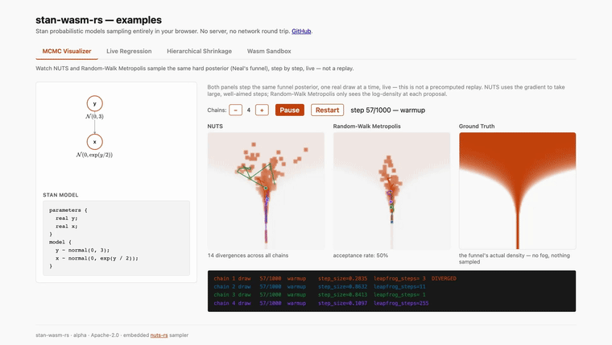

# stanwasm

> **Status: alpha** — usable but pre-1.0, API may change, Stan language coverage is a subset (see below). Not a replacement for [cmdstan](https://github.com/stan-dev/cmdstan) or [Stan Playground](https://github.com/flatironinstitute/stan-playground); intended for browser-embedded use cases where those don't fit.

Stan probabilistic models compiled and sampled entirely inside the browser. Pure Rust, single `~466 KB` wasm bundle (`~180 KB` gzipped), embedded [`nuts-rs`](https://github.com/pymc-devs/nuts-rs) sampler, zero backend required.



## When to use this (and when not)

| Need | Use this | Use cmdstan / Stan Playground instead |
|---|---|---|
| Full Stan language coverage | | ✓ |
| Run in a browser with no server | ✓ | |
| Embed a Bayesian model into a web app (npm package) | ✓ | |
| Data must not leave the user's device | ✓ | |
| Offline / air-gapped environment | ✓ | |
| Research / publication-grade workflows | | ✓ |
| `functions { ... }` block, full multivariate suite | | ✓ |

[Stan Playground](https://stan-playground.flatironinstitute.org) is the official Stan-recommended browser interface; it uses a compile server and supports the full Stan language. stanwasm is **complementary**: smaller surface, no server, embeddable.

## Validated end-to-end

Linear regression posterior recovers the true slope to ±0.3 in 1000 post-warmup draws (seed=42). AOT codegen output agrees with the AST oracle to 1e-12 on log_prob and gradients, checked on `normal`, `exponential`, `poisson`, `multi_normal_cholesky` and `lkj_corr_cholesky` (`crates/stan-codegen/tests/aot_vs_oracle.rs`); the remaining distributions are covered by hand-computed log-density tests against the AST evaluator only.

## Stan language coverage

Distributions covered:
- Continuous: `normal`, `std_normal`, `exponential`, `half_normal`, `cauchy`, `student_t`, `lognormal`, `gamma`, `beta`
- Discrete: `bernoulli`, `bernoulli_logit`, `poisson`, `neg_binomial_2`
- Multivariate: `multi_normal_cholesky`, `lkj_corr_cholesky`, `dirichlet`

Constraint transforms:
- Scalar: `lower`, `upper`, `lower_upper`
- Vector: same with element-wise broadcast
- Vector shape: `simplex`, `ordered`, `positive_ordered`
- Matrix: `cholesky_factor_corr`

Blocks: `data`, `parameters`, `transformed parameters`, `model`, `generated quantities`, plus `for`/`while` loops, `if`/`else`, `break`/`continue`, comparison/logical operators, sampling statements (`y ~ dist(...)`), and `target += expr`. `if`/`while` conditions that depend on a sampled parameter work in `generated quantities` (re-evaluated natively per draw) but are a compile-time error in `model`/`transformed parameters` — NUTS traces that block once and replays the same graph for every draw, so a parameter-dependent branch can't be honored there.

`generated quantities` supports RNG draws for every covered distribution above (`normal_rng`, `exponential_rng`, `gamma_rng`, `dirichlet_rng`, `multi_normal_cholesky_rng`, etc.) plus `uniform_rng`. It runs natively (tape-replay) inside the same wasm bundle — there is no separate AOT-compiled path for it (see [Architecture](#architecture)).

**The scalar `_rng` functions are scalar-only.** `real y = normal_rng(mu, sigma);` works; `normal_rng` applied to a vector argument is an error, not a vectorized draw. Combined with indexed assignment not being implemented (`y_rep[n] = ...` is a clean error), that rules out the usual posterior-predictive idiom:

```stan
generated quantities {
  vector[N] y_rep;
  for (n in 1:N) y_rep[n] = normal_rng(alpha + beta * x[n], sigma);  // NOT supported
}
```

Only `dirichlet_rng` and `multi_normal_cholesky_rng` return containers, because their draw *is* a vector. Vectorized scalar RNG and indexed assignment are both tracked in [`ROADMAP.md`](ROADMAP.md).

**Not yet supported** — each of these is a clean load-time or evaluation error, never a silently different answer:

- Distributions: `multi_normal` (full covariance), `multinomial`, `categorical`, and `lkj_corr_cholesky_rng`
- Constraint types: `cov_matrix`, `cholesky_factor_cov`, `corr_matrix`, `unit_vector`
- `functions { ... }` (user-defined functions)
- Matrix algebra with the generic operators: `X * beta` (matrix × vector) is not a matrix product. Write the loop form, `for (n in 1:N) ... X[n] * beta`, or use `multi_normal_cholesky`, whose matrix work is done internally.
- Indexed assignment: `y_rep[n] = ...;` and vectorized scalar `_rng`
- `transformed data { ... }` parses, but its statements are folded into the `model` block, so they re-run every trace and the variables they define are not visible from `generated quantities`.

Stan's static typing is honored where it changes results: `int / int` is integer division (`N / 2` with `N = 3` is `1`), and `^` binds tighter than unary minus and associates right (`-a^2` is `-(a^2)`, `2^3^2` is `512`).

The `data` block is checked against the supplied JSON when the model loads — a missing field, a wrong length, a non-integral `int`, or a violated `<lower=...>`/`<upper=...>` bound is an error rather than a model that samples the wrong thing.

See [`ARCHITECTURE.md`](ARCHITECTURE.md) for an internals tour and [`docs/en/BENCHMARKS.md`](docs/en/BENCHMARKS.md) for performance numbers. Documentation is organized by language under `docs/en/` and `docs/ja/`.

## Architecture

```
Stan source + JSON data
       │
       ▼  (one-time)
stan-parser ─► AST ─► stan-runtime (trace forward pass on autodiff tape)
                                      │
                                      ▼
                          ┌──── tape replay (sampling)
                          │              │
                          │              ▼
                          │         nuts-rs (embedded in same wasm)
                          │              │
                          │              ▼
                          │           samples
                          │
                          └──── stan-codegen (wasm-encoder)  ──►  AOT model wasm bytes
                                                                  (Web Worker handoff)
```

A single `stan_wasm_api_bg.wasm` is shipped to the browser (replaces the previous `wasm_api.wasm` + `nuts_rs.wasm` pair). Native builds expose the AST evaluation interpreter for golden-value testing only.

## Workspace layout

| Crate | Target | Role |
|---|---|---|
| `stan-ast` | lib | AST types, shared definitions |
| `stan-parser` | lib | Lexer, parser, error reporting |
| `stan-autodiff` | lib | Reverse-mode tape (flat array) |
| `stan-runtime` | lib | Distributions, constraints, AST evaluator (reference oracle) |
| `stan-codegen` | lib | AOT compilation: tape → wasm bytes (via `wasm-encoder`) |
| `stan-wasm-api` | cdylib (wasm32) | wasm-bindgen public API; embeds nuts-rs |
| `stan-cli` | bin (native) | Local development, golden-value tests, benchmarks |

## Quick start (browser / Node.js)

**Not published to npm or crates.io yet** — build from source for now. `ts/` is the package that will be published, so the import path below is what it will be either way.

```bash
# Build the wasm bundle into ts/pkg/
./scripts/build-wasm.sh

# Run the smoke test
cd ts
node --experimental-strip-types tests/smoke.ts
```

To use it from another project before it is on npm, point at the checkout: `npm install /path/to/stanwasm/ts` (or `npm pack` in `ts/` and install the tarball). The entry point is plain `.js` with a `.d.ts` alongside, so bundlers and plain-JS consumers work without a TypeScript step.

```ts
import init, { StanModel } from "stanwasm";

await init();

const stanCode = `...`;
const data = { N: 30, x: [...], y: [...] };
const model = new StanModel(stanCode, JSON.stringify(data));

console.log(`n_params = ${model.n_params}`);
console.log(`names    = ${model.paramNames().join(", ")}`);

// Single-call gradient
const lpAndGrad = model.logProbGrad(new Float64Array([0, 1, 0]));
//   [logp, dα, dβ, dlog_σ]

// Full NUTS sampling
const samples = model.sample(
  new Float64Array([0, 0, 0]),
  /*nWarmup*/ 1000,
  /*nDraws*/  1000,
  /*seed*/    42n,
);
// samples is Float64Array, row-major shape (nWarmup + nDraws) × n_params

// `sample()`/`sampleViaAot` return unconstrained draws; get constrained
// parameter values (e.g. sigma on its natural, not log, scale) per draw:
const constrained = model.constrainDraw(samples.slice(0, model.n_params));

// If the model has a `generated quantities` block, evaluate it over a batch
// of draws (one shared, seeded RNG stream across the whole batch):
console.log(model.genQuantityNames().join(", "));
const gq = model.generatedQuantities(samples, /*nDraws*/ 1000 + 1000, /*seed*/ 7n);

// Want to watch the sampler work rather than just get the finished draws?
// startStepSampling/stepDraw keep the NUTS chain's state alive between
// calls, so you can drive it one draw at a time (e.g. one per animation
// frame) instead of blocking on the whole run:
model.startStepSampling(new Float64Array([0, 0, 0]), 500, 500, 42n);
const draw = model.stepDraw();
// [alpha, beta, log_sigma, tuning(0/1), diverging(0/1), step_size, num_steps]
// step_size/num_steps are nuts-rs's own live adaptation state, not values
// this crate computes.
```

### Demos

[`examples/gallery`](examples/gallery) — one app, tabbed:

- **MCMC Visualizer** — NUTS and Random-Walk Metropolis step the same hard posterior (Neal's funnel) side by side, one real draw per animation frame, via the step-by-step sampling API (`startStepSampling`/`stepDraw`) — not a replay of a finished chain.
- **Live Regression** — drag a data point and watch a robust (Student-t) and a conjugate (normal) regression refit **live**, every animation frame, diverging on the outlier — no closed form for the former, no server round trip for either.
- **Hierarchical Shrinkage** — six marketing campaigns' observed A/B test lift (three well-powered, three small-sample pilots) fit with a partial-pooling model (the classic "eight schools" structure). Drag one's observed value and watch a flashy small-sample number get pulled toward the population estimate live, by an amount the posterior derives rather than a hand-tuned rule.
- **Wasm Sandbox** — a fuller API tour: CSV upload, editable Stan source, multiple presets, posterior summary table.

## Native development

Requires Rust 1.88+ (the workspace MSRV; `nuts-rs` needs edition 2024).

```bash
cargo build --release
cargo test                    # ~76 tests across all crates
cargo run --release -p stan-cli -- bench all
```

## Contributing

See [`CONTRIBUTING.md`](CONTRIBUTING.md). The project is in alpha and maintained on evenings and weekends, so issue triage and PR reviews happen in batches. Distribution / constraint additions and example PRs are especially welcome.

For the broader Stan ecosystem (cmdstan, stanc3, official interfaces), see [stan-dev](https://github.com/stan-dev). For the official browser playground, see [Stan Playground](https://github.com/flatironinstitute/stan-playground).

## License

Apache-2.0 — see [`LICENSE`](LICENSE).
